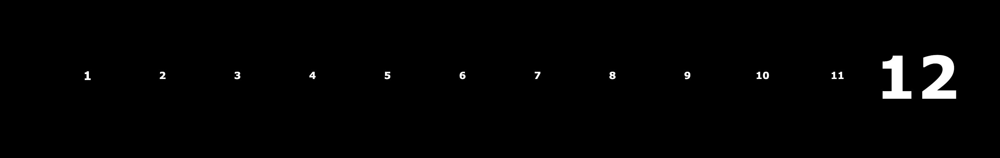
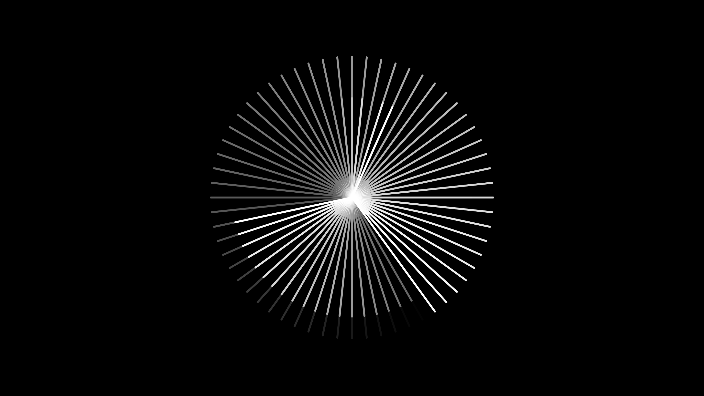
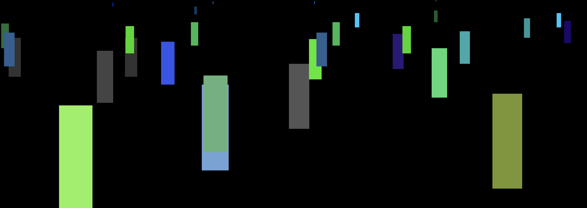
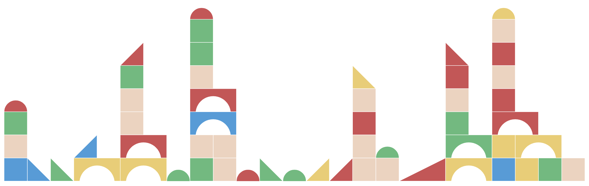
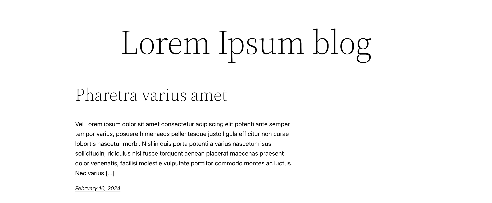

```
 __  __     ______     __         __         ______        __     __     ______     ______     __         _____    
/\ \_\ \   /\  ___\   /\ \       /\ \       /\  __ \      /\ \  _ \ \   /\  __ \   /\  == \   /\ \       /\  __-.  
\ \  __ \  \ \  __\   \ \ \____  \ \ \____  \ \ \/\ \     \ \ \/ ".\ \  \ \ \/\ \  \ \  __<   \ \ \____  \ \ \/\ \ 
 \ \_\ \_\  \ \_____\  \ \_____\  \ \_____\  \ \_____\     \ \__/".~\_\  \ \_____\  \ \_\ \_\  \ \_____\  \ \____- 
  \/_/\/_/   \/_____/   \/_____/   \/_____/   \/_____/      \/_/   \/_/   \/_____/   \/_/ /_/   \/_____/   \/____/ 
```

- [Clocks](#clocks)
- [Not clocks](#not-clocks)
- [Links](#links)

<a id="clocks"></a>
```
 ______     __         ______     ______     __  __     ______
/\  ___\   /\ \       /\  __ \   /\  ___\   /\ \/ /    /\  ___\
\ \ \____  \ \ \____  \ \ \/\ \  \ \ \____  \ \  _"-.  \ \___  \
 \ \_____\  \ \_____\  \ \_____\  \ \_____\  \ \_\ \_\  \/\_____\
  \/_____/   \/_____/   \/_____/   \/_____/   \/_/\/_/   \/_____/
```

- [8UYwZK4](https://rickvanderwolk.cc/8UYwZK4/)
  [](https://rickvanderwolk.cc/8UYwZK4/)
- [Ant](https://rickvanderwolk.cc/ant/)
- [Aviation](https://rickvanderwolk.cc/aviation/)
- [Barcode clock](https://rickvanderwolk.cc/barcode-clock/)
- [Binary](https://rickvanderwolk.cc/binary/)
- [Blur](https://rickvanderwolk.cc/blur/)
- [Bouncing balls](https://rickvanderwolk.cc/bouncing-balls/)
- [c41571a3](https://rickvanderwolk.cc/c41571a3/)
- [Chill](https://rickvanderwolk.cc/chill/)
- [Color wheel](https://rickvanderwolk.cc/color-wheel/)
- [Conflict](https://rickvanderwolk.cc/conflict/)
- [Countdown clock](https://rickvanderwolk.cc/countdown-clock/)
- [d5d956e0](https://rickvanderwolk.cc/d5d956e0/)
- [d6812596](https://rickvanderwolk.cc/d6812596/)
- [d6812597](https://rickvanderwolk.cc/d6812597/)
- [dde96683](https://rickvanderwolk.cc/dde96683/)
- [Decimal clock](https://rickvanderwolk.cc/decimal-clock/)
- [Double](https://rickvanderwolk.cc/double/)
- [Drift](https://rickvanderwolk.cc/drift/)
- [e93f880a](https://rickvanderwolk.cc/e93f880a/)
- [Fall](https://rickvanderwolk.cc/fall/)
- [Fizz buzz clock](https://rickvanderwolk.cc/fizz-buzz-clock/)
- [Gate](https://rickvanderwolk.cc/gate/)
  [](https://rickvanderwolk.cc/gate/)
- [Hammer time](https://rickvanderwolk.cc/hammer-time/)
- [HEX color clock](https://rickvanderwolk.cc/hex-color-clock/)
- [Helicopter clock](https://rickvanderwolk.cc/helicopter-clock/)
- [HTML title clock](https://rickvanderwolk.cc/html-title-clock/)
  [](https://rickvanderwolk.cc/html-title-clock/)
- [Insecure](https://rickvanderwolk.cc/insecure/)
- [LESe26faM4](https://rickvanderwolk.cc/LESe26faM4/)
  [](https://rickvanderwolk.cc/LESe26faM4/)
- [Letter clock](https://rickvanderwolk.cc/letter-clock/)
- [Look](https://rickvanderwolk.cc/look/)
- [One day](https://rickvanderwolk.cc/one-day/)
- [Palindrome clock](https://rickvanderwolk.cc/palindrome-clock/)
- [Panic](https://rickvanderwolk.cc/panic/)
- [Pie charts clock](https://rickvanderwolk.cc/pie-charts-clock/)
- [Pixels](https://rickvanderwolk.cc/pixels/)
- [Random clock](https://rickvanderwolk.cc/random-clock/)
- [RGB color clock](https://rickvanderwolk.cc/rgb-color-clock/)
- [Rows and columns](https://rickvanderwolk.cc/rows-and-columns-clock/)
- [Satisfaction level 1](https://rickvanderwolk.cc/satisfaction-level-1/)
- [Satisfaction level 2](https://rickvanderwolk.cc/satisfaction-level-2/)
- [Scroll clock](https://rickvanderwolk.cc/scroll-clock/)
- [Shifted](https://rickvanderwolk.cc/shifted/)
- [Software update clock](https://softwareupdateclock.com/)
- [Sour](https://rickvanderwolk.cc/sour/)
- [Sun position clock](https://rickvanderwolk.cc/sun-position-clock/)
- [Sunlight clock](https://rickvanderwolk.cc/sunlight-clock/)
- [Tennis clock](https://rickvanderwolk.cc/tennis-clock/)
- [Terminal clock](https://rickvanderwolk.cc/terminal-clock/)
- [Trial clock](https://rickvanderwolk.cc/trial-clock/)
- [Unix gradient](https://unixgradient.org/)
- [Windup clock](https://rickvanderwolk.cc/wind-up-clock/)
- [Zoo](https://rickvanderwolk.cc/zoo/)

<a id="not-clocks"></a>
```
 __   __     ______     ______      ______     __         ______     ______     __  __     ______    
/\ "-.\ \   /\  __ \   /\__  _\    /\  ___\   /\ \       /\  __ \   /\  ___\   /\ \/ /    /\  ___\   
\ \ \-.  \  \ \ \/\ \  \/_/\ \/    \ \ \____  \ \ \____  \ \ \/\ \  \ \ \____  \ \  _"-.  \ \___  \  
 \ \_\\"\_\  \ \_____\    \ \_\     \ \_____\  \ \_____\  \ \_____\  \ \_____\  \ \_\ \_\  \/\_____\ 
  \/_/ \/_/   \/_____/     \/_/      \/_____/   \/_____/   \/_____/   \/_____/   \/_/\/_/   \/_____/ 
                                                                                                                                                                                          
```

- [3oGVnm6](https://rickvanderwolk.cc/3oGVnm6/)
  [](https://rickvanderwolk.cc/3oGVnm6/)
- [Balonne](https://rickvanderwolk.cc/balonne/)
- [Building blocks](https://rickvanderwolk.cc/building-blocks/)
  [](https://rickvanderwolk.cc/building-blocks/)
- [Butterfly](https://rickvanderwolk.cc/butterfly/)
- [Calculator](https://rickvanderwolk.cc/calculator/)
- [Copy page](https://rickvanderwolk.cc/copy-page/)
- [Evolving square](https://rickvanderwolk.cc/evolving-square/)
- [Hide and geek](https://rickvanderwolk.cc/hide-and-geek/)
- [Home page](https://rickvanderwolk.cc/home-page/)
- [Hs3RwAx](https://rickvanderwolk.cc/Hs3RwAx/)
- [Hs3RwBx](https://rickvanderwolk.cc/Hs3RwBx/)
- [Hs3RwCx](https://rickvanderwolk.cc/Hs3RwCx/)
- [Light saver](https://rickvanderwolk.cc/light-saver/)
- [Lorem ipsum blog](https://rickvanderwolk.cc/lorem-ipsum-blog/)
  [](https://rickvanderwolk.cc/lorem-ipsum-blog/)
- [Messy canvas](https://rickvanderwolk.cc/messy-canvas/)
- [Noise](https://rickvanderwolk.cc/noise/)
- [QR code loop](https://rickvanderwolk.cc/qr-code-loop/)
- [Scroll race](https://rickvanderwolk.cc/scroll-race/)
- [Tuner](https://rickvanderwolk.cc/tuner/)
- [X marks the spot](https://rickvanderwolk.cc/x-marks-the-spot/)

<a id="links"></a>
```
 __         __     __   __     __  __     ______    
/\ \       /\ \   /\ "-.\ \   /\ \/ /    /\  ___\   
\ \ \____  \ \ \  \ \ \-.  \  \ \  _"-.  \ \___  \  
 \ \_____\  \ \_\  \ \_\\"\_\  \ \_\ \_\  \/\_____\ 
  \/_____/   \/_/   \/_/ \/_/   \/_/\/_/   \/_____/ 
```

Books

- [1000 Chairs - Charlotte Fiell, Peter Fiell](https://www.goodreads.com/book/show/1083029)
- [1000 Lights - Charlotte Fiell](https://www.goodreads.com/book/show/17879332)
- [All My Friends Are Dead - Avery Monsen, Jory John](https://www.goodreads.com/book/show/8044557)
- [Clean Code - Robert C. Martin](https://www.goodreads.com/work/quotes/3779106)
- [Flow - Mihály Csíkszentmihályi](https://www.goodreads.com/work/quotes/64339)
- [On The Shortness Of Life - Seneca](https://www.goodreads.com/work/quotes/1374471)
- [Refuse To Choose! - Barbare Sher](https://www.goodreads.com/work/quotes/279246)
- [The Creative Act - Rick Rubin](https://www.goodreads.com/work/quotes/96114890)
- [Toa Te Ching - Lao Tzu](https://www.goodreads.com/work/quotes/100074)

Music

- [Grandmix - Ben Liebrand](https://liebrand.nl/grandmix/index.html)

Other

- [ASCII art generator](https://patorjk.com/software/taag/)
- [RedBubble shop](https://www.redbubble.com/people/rickkkkk/shop?asc=u)

### Licensing

This project’s original code is released under the CC0 1.0 Universal license.

This project also includes third-party libraries:
- **jQuery** is provided under the MIT License.
- **p5.js** is provided under the LGPL 2.1 license.

For more information, please see the `LICENSES.md` file.
