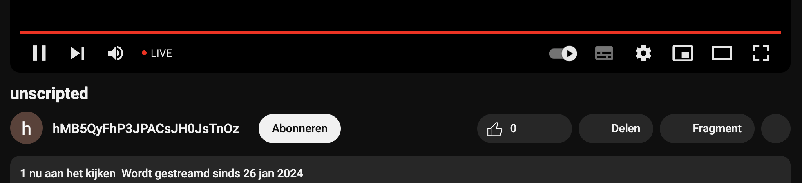

```
 __  __     ______     __         __         ______        __     __     ______     ______     __         _____    
/\ \_\ \   /\  ___\   /\ \       /\ \       /\  __ \      /\ \  _ \ \   /\  __ \   /\  == \   /\ \       /\  __-.  
\ \  __ \  \ \  __\   \ \ \____  \ \ \____  \ \ \/\ \     \ \ \/ ".\ \  \ \ \/\ \  \ \  __<   \ \ \____  \ \ \/\ \ 
 \ \_\ \_\  \ \_____\  \ \_____\  \ \_____\  \ \_____\     \ \__/".~\_\  \ \_____\  \ \_\ \_\  \ \_____\  \ \____- 
  \/_/\/_/   \/_____/   \/_____/   \/_____/   \/_____/      \/_/   \/_/   \/_____/   \/_/ /_/   \/_____/   \/____/ 
```

This is my creative coding playground.

- [Live](#live)
- [Clocks](#clocks)
- [GRRR](#grrr)
- [Other](#other)
- [Inspiration](#inspiration)

<a id="live"></a>
## Live
- [Lorem ipsum blog](https://rickvanderwolk.cc/lorem-ipsum-blog/)
[](https://rickvanderwolk.cc/lorem-ipsum-blog/)
- [Unscripted](https://www.youtube.com/watch?v=OctNFWsr9WQ)
[](https://rickvanderwolk.cc/unscripted/)

<a id="clocks"></a>
## Clocks

- [8UYwZK4](https://rickvanderwolk.cc/8UYwZK4/)
  [](https://rickvanderwolk.cc/8UYwZK4/)
- [Ant](https://rickvanderwolk.cc/ant/)
- [Aviation](https://rickvanderwolk.cc/aviation/)
- [Barcode clock](https://rickvanderwolk.cc/barcode-clock/)
- [Binary](https://rickvanderwolk.cc/binary/)
- [Conflict](https://rickvanderwolk.cc/conflict/)
- [Decimal clock](https://rickvanderwolk.cc/decimal-clock/)
- [Double](https://rickvanderwolk.cc/double/)
- [Fizz buzz clock](https://rickvanderwolk.cc/fizz-buzz-clock/)
- [Gate](https://rickvanderwolk.cc/gate/)
  [](https://rickvanderwolk.cc/gate/)
- [HEX color clock](https://rickvanderwolk.cc/hex-color-clock/)
- [Helicopter clock](https://rickvanderwolk.cc/helicopter-clock/)
- [HTML title clock](https://rickvanderwolk.cc/html-title-clock/)
  [](https://rickvanderwolk.cc/html-title-clock/)
- [LESe26faM4](https://rickvanderwolk.cc/LESe26faM4/)
  [](https://rickvanderwolk.cc/LESe26faM4/)
- [Letter clock](https://rickvanderwolk.cc/letter-clock/)
- [Look](https://rickvanderwolk.cc/look/)
- [Palindrome clock](https://rickvanderwolk.cc/palindrome-clock/)
- [Pie charts clock](https://rickvanderwolk.cc/pie-charts-clock/)
- [Random clock](https://rickvanderwolk.cc/random-clock/)
- [RGB color clock](https://rickvanderwolk.cc/rgb-color-clock/)
- [Rows and columns](https://rickvanderwolk.cc/rows-and-columns-clock/)
- [Satisfaction level 1](https://rickvanderwolk.cc/satisfaction-level-1/)
- [Satisfaction level 2](https://rickvanderwolk.cc/satisfaction-level-2/)
- [Shifted](https://rickvanderwolk.cc/shifted/)
- [Software update clock](https://softwareupdateclock.com/)
- [Sun position clock](https://rickvanderwolk.cc/sun-position-clock/)
- [Terminal clock](https://rickvanderwolk.cc/terminal-clock/)
- [Unix gradient](https://unixgradient.org/)
- [Windup clock](https://rickvanderwolk.cc/wind-up-clock/)

<a id="grrr"></a>
## GRRR

- [Grrr.li](https://grrr.li)

<a id="other"></a>
## Other

- [3oGVnm6](https://rickvanderwolk.cc/3oGVnm6/)
  [](https://rickvanderwolk.cc/3oGVnm6/)
- [Balonne](https://rickvanderwolk.cc/balonne/)
- [Building blocks](https://rickvanderwolk.cc/building-blocks/)
  [](https://rickvanderwolk.cc/building-blocks/)
- [Calculator](https://rickvanderwolk.cc/calculator/)
- [Copy page](https://rickvanderwolk.cc/copy-page/)
- [Evolving square](https://rickvanderwolk.cc/evolving-square/)
- [Home page](https://rickvanderwolk.cc/home-page/)
- [Hs3RwAx](https://rickvanderwolk.cc/Hs3RwAx/)
- [Hs3RwBx](https://rickvanderwolk.cc/Hs3RwBx/)
- [Hs3RwCx](https://rickvanderwolk.cc/Hs3RwCx/)
- [Light saver](https://rickvanderwolk.cc/light-saver/)
- [Messy canvas](https://rickvanderwolk.cc/messy-canvas/)
- [Noise](https://rickvanderwolk.cc/noise/)
- [QR code loo](https://rickvanderwolk.cc/qr-code-loop/)
- [Tuner](https://rickvanderwolk.cc/tuner/)
- [X marks the spot](https://rickvanderwolk.cc/x-marks-the-spot/)

<a id="inspiration"></a>
## Inspiration

### Books

- Barbare Sher - Refuse To Choose! [quotes on goodreads.com](https://www.goodreads.com/work/quotes/279246)
- Rick Rubin - The Creative Act [quotes on goodreads.com](https://www.goodreads.com/work/quotes/96114890)
- Lao Tzu - Toa Te Ching [quotes on goodreads.com](https://www.goodreads.com/work/quotes/100074)
- Robert C. Martin - Clean Code [quotes on goodreads.com](https://www.goodreads.com/work/quotes/3779106)
- Charlotte Fiell - 1000 Lights [info on goodreads.com](https://www.goodreads.com/book/show/17879332)
- Charlotte Fiell, Peter Fiell - 1000 Chairs [info on goodreads.com](https://www.goodreads.com/book/show/1083029)
- Mihály Csíkszentmihályi - Flow [quotes on goodreads.com](https://www.goodreads.com/work/quotes/64339)
- Seneca - On The Shortness Of Life [quotes on goodreads.com](https://www.goodreads.com/work/quotes/1374471)
- Avery Monsen, Jory John - All My Friends Are Dead [info on goodreads.com](https://www.goodreads.com/book/show/8044557)
